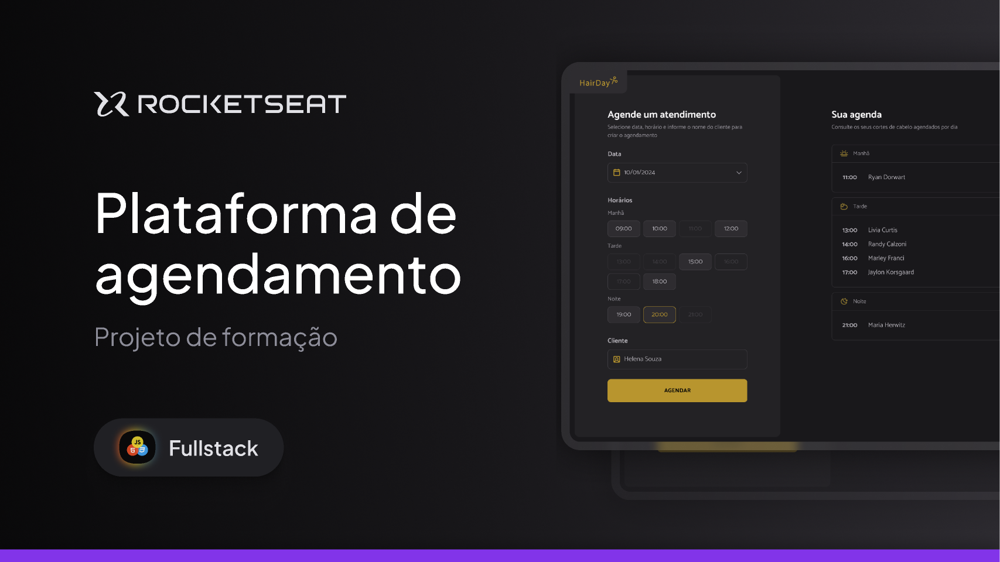

# Hairday - A JavaScript & HTML Study Project



Welcome to the Hairday project! This is a hands-on project for studying modern web development concepts, including JavaScript (ES Modules), HTML, and how to set up a development environment from scratch with powerful tools like webpack, Babel, and a mock API server.

## ✨ Features

*   **Modern JavaScript:** Uses ES6+ features and ES Modules for a clean code structure.
*   **Module Bundling:** All JavaScript modules are bundled into a single file for production using webpack.
*   **Transpilation:** Babel is configured to transpile modern JavaScript into a backward-compatible version to run in most browsers.
*   **Development Server:** Comes with `webpack-dev-server` for a smooth development experience with live reloading.
*   **Mock API:** A fake REST API is provided using `json-server` to simulate a real backend.

## 🛠️ Technologies Used

*   **Frontend:**
    *   HTML5
    *   JavaScript (ES6+)
*   **Build Tools & Environment:**
    *   Node.js
    *   Webpack: Module bundler.
    *   Babel: JavaScript compiler.
    *   json-server: To create a fake REST API.
    *   webpack-dev-server: Development server.

## 🚀 Getting Started

Follow these instructions to get a copy of the project up and running on your local machine for development and testing.

### Prerequisites

You need to have Node.js (which includes npm) installed on your machine.

### Installation

1.  Clone the repository to your local machine:
    ```sh
    git clone <your-repository-url>
    cd hairday
    ```

2.  Install the project dependencies:
    ```sh
    npm install
    ```

### Running the Project

The project requires two services to run concurrently: the mock API server and the frontend development server. It's best to run them in two separate terminal tabs.

1.  **Start the JSON server:**

    This command starts a mock REST API on `http://localhost:3000`.
    ```sh
    npm run server
    ```
    > **Note:** If you don't have this script, you can add it to your `package.json`:
    > ```json
    > "scripts": {
    >   "server": "json-server --watch db.json"
    > }
    > ```

2.  **Start the Webpack Development Server:**

    This will start the frontend application and automatically open it in your browser at `http://localhost:8080`.
    ```sh
    npm run dev
    ```

### Building for Production

To create an optimized build for a production environment, run:

```sh
npm run build
```

This command will bundle and minify your code into the `dist` folder.

## 📁 Project Structure

Here is a suggested file structure for this project:

```
hairday/
├── dist/                # Production build files
├── node_modules/        # Project dependencies
├── src/                 # Source files
│   ├── assets/          # images, fonts, etc.
│   ├── libs/            # Dayjs config
│   ├── modules/         # Js scripts
│   ├── services/        # Api access
│   ├── Styles           # CSS files
│   ├── Utils            # Definition of opening hours
├── index.js             # Main JS entry point
├── index.html           # Main HTML file
├── db.json              # Mock API database
├── package.json         # Project metadata and dependencies
├── webpack.config.js    # Webpack configuration
└── README.md            # This file
```

## 📄 License

This project is open-source and available under the MIT License.